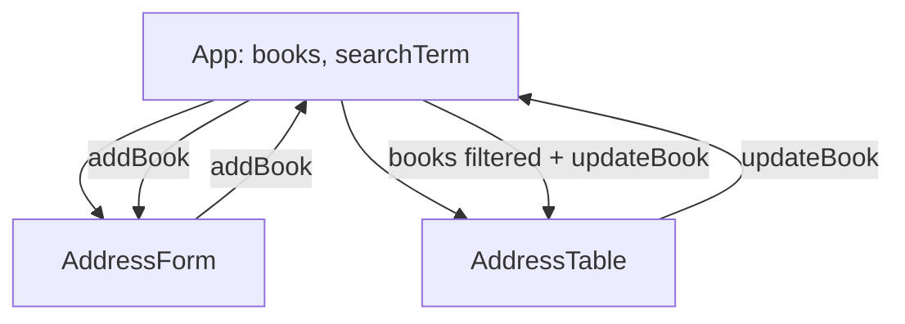

## Diagram 

## Patterns used for rendering the table:

1. Container-Presenter Pattern

 - The `App` component acts as a Container, managing state (`books`) and logic (`updateBook`),

 - The `AddressTable` component acts as a Presenter, responsible only for displaying and editing rows.

2. Controlled Components Pattern

 - The input fields inside the table are controlled components, with values stored in the component’s state (`editForm`).

3. Conditional Rendering Pattern

 - The component conditionally renders either plain text or input fields depending on the editing state (`editId`).

4. Lifting State Up

 - The main data (`books`) is stored in the parent component (`App`), and passed down via props.
